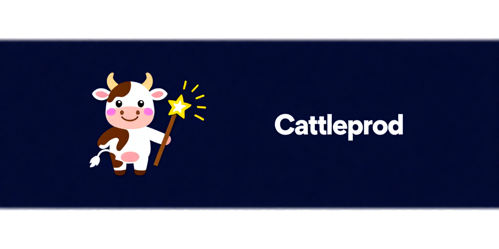

# opencode-cattleprod



`opencode-cattleprod` is an OpenCode plugin that nudges a session to continue when the model stops on its own while the session still has unfinished todos.

It is meant for workflows where you want OpenCode to keep working until the tracked todo list is actually complete.

## What it does

- Watches for `session.idle` events.
- Checks the session todo list.
- If unfinished todos remain, sends a follow-up prompt asking OpenCode to continue until the todos are done.
- Avoids repeating the exact same prod message back-to-back.
- Skips auto-continuation immediately after a user-triggered `session.interrupt` command.

## Install

Clone the repo somewhere local, then add it to your OpenCode config as a `file://` plugin entry:

```json
{
  "plugin": ["file:///absolute/path/to/opencode-cattleprod"]
}
```

For example:

```json
{
  "plugin": ["file:///home/your-user/Projects/opencode-cattleprod"]
}
```

This matches how local plugins are loaded in OpenCode today. If you later publish the package to npm, you can switch to a package-name entry instead.

## Behavior notes

- This plugin only acts when a session has a todo list.
- If all todos are `completed` or `cancelled`, it does nothing.
- The continue prompt is visible in the session history because it is sent as a user message through the OpenCode plugin API.
- It is intentionally conservative around manual stops so a user interrupt does not immediately trigger another continuation.

## Development

Install dependencies and run typechecking:

```bash
npm install
npm run typecheck
```

## License

MIT
